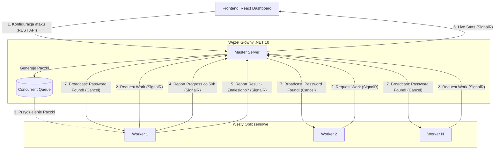

# Password Breaker: Rozproszony System Łamania Haseł

Wysokowydajny, rozproszony system typu Klient-Serwer służący do odzyskiwania haseł (hashy) metodą brute-force. Projekt wykorzystuje pełen potencjał wielowątkowości procesorów poprzez skalowanie pionowe (Task Parallel Library w C#) oraz poziome (wiele węzłów łączących się z węzłem nadrzędnym).

## 💡 Architektura Systemu

System bazuje na podejściu **Dynamic Pull** z architekturą Master-Worker. Serwer nadrzędny dzieli całą przestrzeń poszukiwań na małe "paczki" (chunks) po 1 000 000 haseł. Workery (węzły wykonawcze) same "proszą" o pracę, co gwarantuje naturalny Load Balancing (szybsze workery po prostu przetworzą więcej paczek).

### Diagram Architektury (C4 / Przepływ Danych)



## 🛠️ Moduły i Technologie

1. **PasswordBreaker.Shared**
   - *Technologia:* .NET 10 Class Library
   - *Rola:* Kontrakty komunikacyjne, algorytmy generowania ciągów brute-force (`Span<T>`), dostawcy kryptografii (MD5, SHA256, Argon2).
2. **PasswordBreaker.Server (Master)**
   - *Technologia:* ASP.NET Core 10, SignalR, Concurrent Collections
   - *Rola:* Rejestruje Workery, dzieli pracę na fragmenty (chunking), zbiera statystyki cząstkowe, wysyła sygnały przerwania.
3. **PasswordBreaker.Worker (Węzeł wykonawczy)**
   - *Technologia:* .NET 10 Worker Service, Task Parallel Library (TPL)
   - *Rola:* W pełni obciąża procesor maszyny na której się znajduje (`Parallel.For`), zgłasza postępy w mniejszych interwałach, nasłuchuje na globalny `CancellationToken`.
4. **PasswordBreaker.Frontend (Dashboard)**
   - *Technologia:* React 18, TypeScript, Vite, TailwindCSS v4, Recharts
   - *Rola:* Wyświetla ładny, pływający z prędkością 5 FPS interfejs statystyk w czasie rzeczywistym.

## 🚀 Instrukcja Uruchomienia (Krok po kroku)

Aplikacja składa się z 3 elementów, które należy uruchomić niezależnie (w osobnych oknach terminala):

### 1. Uruchomienie Serwera (Master)
Otwórz terminal w katalogu głównym projektu i przejdź do folderu serwera:
```bash
cd PasswordBreaker.Server
dotnet run
```
*Serwer wystartuje na porcie `http://localhost:5000`*

### 2. Uruchomienie Frontendu (UI)
Otwórz drugi terminal, przejdź do folderu frontendu:
```bash
cd PasswordBreaker.Frontend
npm install    # (Tylko za pierwszym razem)
npm run dev
```
*Panel będzie dostępny pod adresem `http://localhost:5173/`*

### 3. Uruchomienie Węzłów Roboczych (Workery)
Otwórz trzeci terminal, przejdź do folderu workera i go uruchom. 
**Aby przetestować skalowanie horyzontalne**, możesz otworzyć 4, 5 lub więcej terminali i w każdym odpalić komendę poniżej!
```bash
cd PasswordBreaker.Worker
dotnet run
```

## 📊 Przeprowadzenie Ataku

1. Przejdź pod adres `http://localhost:5173/`.
2. Do testu szybkości i poprawności działania wpisz następujące parametry:
   - **Target Hash:** `a9c449d4fa44e9e5a41c574ae55ce4d9` *(To MD5 dla słowa "program")*
   - **Algorithm:** `MD5`
   - **Max Length:** `7`
   - **Alphabet:** `abcdefghijklmnopqrstuvwxyz`
3. Naciśnij **Launch Attack**.
4. Wykres ożyje, wyświetlając zagregowane z Workerów dane H/s (Hashes per Second) dzięki raportowaniu co 50 000 sprawdzonych kluczy na każdym wątku. Po zakończeniu, wszystkie workery automatycznie zatrzymają pracę.

## 🧪 Testowanie i Niezawodność
W katalogu `PasswordBreaker.Tests` znajduje się zbiór testów jednostkowych xUnit:
```bash
cd PasswordBreaker.Tests
dotnet test
```
Testują one matematyczną poprawność algorytmów konwertowania indeksu numerycznego (Integer) na konkretny wariant hasła (String) z zadanego alfabetu – niezbędne do precyzyjnego przypisywania przedziałów indeksów (chunków) do Workerów bez powielania pracy.